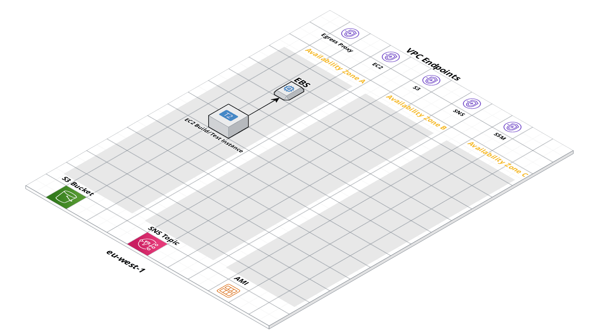

# AWS EC2ImageBuilder Module

 

This repo contains a set of modules for deploying EC2 ImageBuilder components to automate the creation of custom/standardised Amazon Machine Images (AMI's)

## Features
* Deploy Build and Test EC2 instances for AMI creation
* SNS notifications for pipeline activities including executions, failures and updates.
* Automated sharing of AMI's to AWS accounts
* Automated weekly AMI pipeline builds

## Learn
### Core Concepts
### Repo organization

## Deploy
### Development Environment
### Production Environment

## Manage
### Day-to-day operations

## Support

## Contributions
